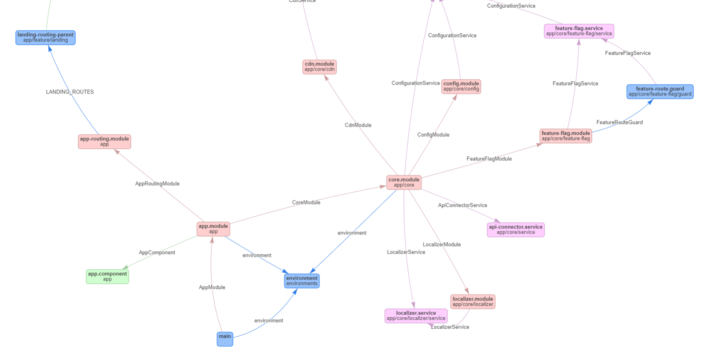

# Typescript (Angular) Dependency Graph drawer

Uses vis.js, check it out, it's pretty cool.

# Usage

## Customize ```depgraph.config.js``` if you want

You can check the example in the package directory (```depgraph.config.js.example```) or you can leave it out completely, default starting folder is the current.

```projectDirectory```: this is the directory where your ```src``` directory is. Without trailing slash.  
```tsconfig```: if you have path aliases defined in tsconfig, you can refer it here. Otherwise ```projectDirectory/tsconfig.json``` is used.  

## Run graph generator

```bash
ts-depgraph
```

## Open depgraph.html


